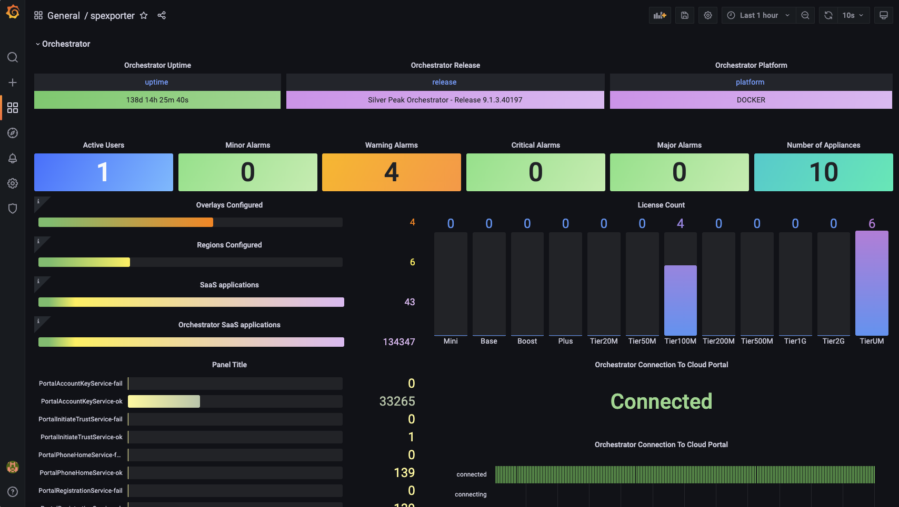
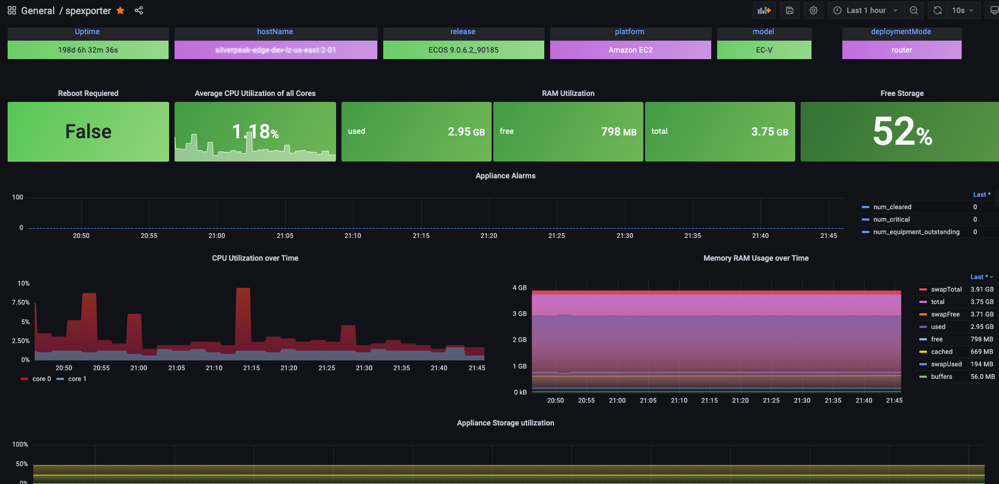
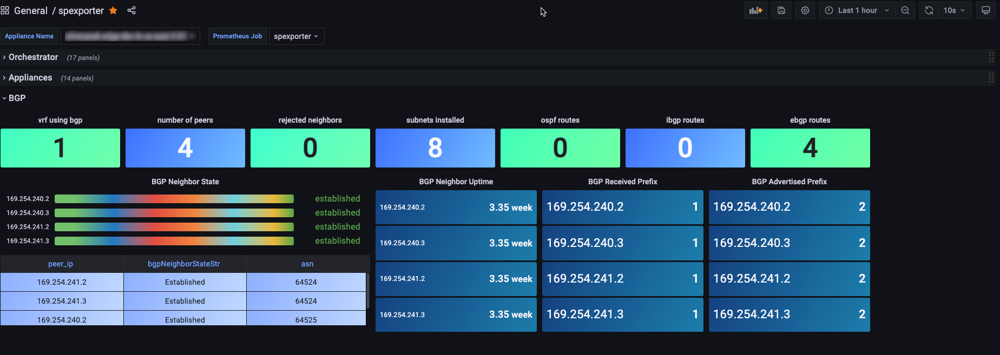

# silverpeak-prometheus-exporter
Silverpeak/Aruba SD-WAN Prometheus Exporter, this tool is to query the Silverpeak/Aruba SD-WAN orchestrator export the metrics to a prometheus database.

## Requierements

- Orchestraor API Key
- Python3.9>=

## Installation Methods
- Installing using [Pypi](https://github.com/ipHeaders/silverpeak-prometheus/tree/main/docs/installing_using_pypi.md)
- Installing directly from [Github](https://github.com/ipHeaders/silverpeak-prometheus/tree/main/docs/installing_from_github.md)
- Running on [Container](https://github.com/ipHeaders/silverpeak-prometheus/tree/main/docs/running_on_container.md)

## References
- Avaiable Exposed Metrics [Metrics](https://github.com/ipHeaders/silverpeak-prometheus/tree/main/docs/metrics.md)
- DockerHub Project [Docker](https://hub.docker.com/r/ipheaders/silverpeak-prometheus)
- Grafana Dashboard [Grafana](https://grafana.com/grafana/dashboards/17745-spexporter/)
- Application Flow [Flow](https://github.com/ipHeaders/silverpeak-prometheus/tree/main/docs/appflow.png)

## Grafana Example
### Orchestrator

### Appliances

### BGP

## Maintainer
[IPheaders](https://github.com/ipHeaders)
